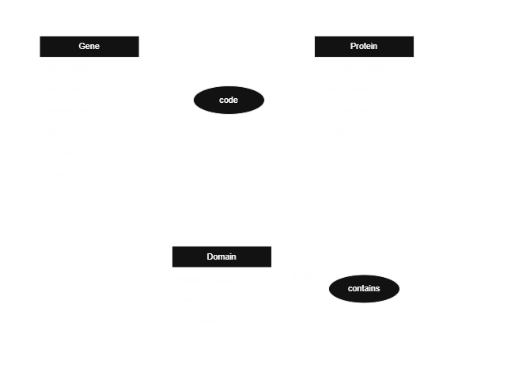

# Rapport du projet 1 MYSQL

Ce projet s’inscrit dans le cadre du module MySQL du master Computational Biology, Bioinformatics and Data Analysis. Le cahier des charges est joint dans le fichier `projet1.pdf`. L'ensomble des scripts et  fichiers utilisés et mentionnés dans le présent rapport sont disponibles sur GitHub dans la repository: https://github.com/salaheddinesannouti/GeneticsSQLProject/tree/master .

# Étape de pré-traitement

Afin de travailler dans des conditions proches d’un contexte réel, des données issues de bases de données biologiques de référence ont été utilisées.

## Données utilisées

Les gènes humains proviennent du jeu de données **Human genes (GRCh38.p14)**. 

La sélection des gènes a été restreinte aux gènes impliqués dans des pathologies cancéreuses à partir de la source **Cancer Gene Census**, qui constitue une liste de gènes à forte valeur de preuve dans le domaine de l’oncologie.  

Les informations ont été extraites à partir de **Ensembl BioMart**, permettant d’obtenir pour chaque gène son symbole, sa localisation chromosomique et ses caractéristiques génomiques.  

Les protéines codées par ces gènes ont été récupérées à partir de la base **UniProtKB**, qui fournit les numéros d’accession, les longueurs, les masses moléculaires et les fonctions biologiques.  

Les domaines fonctionnels des protéines ont été obtenus via **InterPro**, base de données intégrative décrivant les familles, domaines et sites fonctionnels des protéines.  

## Intégration et préparation des données

Les données issues de ces différentes sources étant initialement hétérogènes et isolées, un pipeline de pré-traitement a été développé en **Python** afin de :  

- parser les fichiers sources (Ensembl, UniProtKB, InterPro),  
- effectuer les correspondances entre gènes, protéines et domaines,  
- normaliser les champs selon les contraintes du cahier des charges,  
- convertir l’ensemble au format **CSV** compatible avec l’insertion dans une base de données SQL.  

Cette étape a permis de garantir la cohérence référentielle (gène–protéine–domaine) et la conformité des données aux schémas relationnels définis dans le MLD.  

L’ensemble du script de pré-traitement, des fichiers intermédiaires et des jeux de données finaux est versionné et accessible sur **GitHub**, garantissant la traçabilité, la reproductibilité et la vérifiabilité de l’ensemble du pipeline de construction de la base de données.  

# MCD

Afin de garantir la conformité du modèle à la réalité biologique, ces choix ont été faits :  

- un gène peut produire plusieurs protéines → cardinalité **(1,n)**.  
- Une protéine est codée par un seul gène → cardinalité **(1,1)**.  
- Une protéine contient au moins un domaine → cardinalité **(1,n)**.  
- Un domaine est contenu dans plusieurs protéines → cardinalité **(n,n)**.  

Afin d’éviter toute ambiguïté dans la représentation de la localisation génomique, la position d’un gène sur le chromosome a été modélisée par deux attributs distincts : 
* **chr_start_pos**, indiquant la position de début de la transcription, 

* **chr_end_pos**, indiquant la position de fin de la transcription.  

## Schéma MCD



## MLD 

Gene(**<u>gene_symbol</u>**, gene_name, chromosome, chr_start_pos, chr_end_pos, strand)

Protein(**<u>accession_number</u>**, chain_length, molecular_mass, function, #gene_symbol)

Domain(**<u>domain_name</u>**, family, domain_description)

ProteinContainsDomain(**<u>#accession_number</u>**, **<u>#domain_name</u>**)

## Choix des types de donnée pour chaque attribut
### Table Gene

| Attribut       | Type choisi     | Justification                                                                                       |
|----------------|----------------|---------------------------------------------------------------------------------------------------|
| gene_symbol    | VARCHAR(20)    | Identifiant unique pour chaque gène, facilite les correspondances avec les protéines.            |
| gene_name      | VARCHAR(100)   | Nom complet du gène, texte descriptif modérément long.                                           |
| chromosome     | VARCHAR(5)     | 21 des chromosomes sont numériques, 2 sont (X, Y), donc la chaîne permet de rester flexible. |
| chr_start_pos  | INT            | Position génomique de début sur le chromosome.                  |
| chr_end_pos    | INT            | Position génomique de fin, cohérent avec chr_start_pos.                                          |
| strand         | CHAR(1)        | Indique le brin + ou -, un seul caractère suffit.                                               |

---

### Table Protein

| Attribut           | Type choisi   | Justification                                                                                     |
|-------------------|--------------|-------------------------------------------------------------------------------------------------|
| accession_number   | VARCHAR(50)  | Numéro d’accession UniProt, identifiant alphanumérique unique.                                  |
| gene_symbol        | VARCHAR(20)  | Clé étrangère vers Gene, identifiant du gène codant.                                           |
| chain_length       | INT          | Longueur de la protéine en acides aminés qui est une valeur entière.                                       |
| molecular_mass     | INT          | Masse moléculaire en Daltons, valeur entière adaptée pour stockage.                             |
| protein_function   | TEXT         | Description textuelle parfois longue, nécessite type TEXT.                                     |

---

### Table Domain

| Attribut           | Type choisi   | Justification                                                                                     |
|-------------------|--------------|-------------------------------------------------------------------------------------------------|
| domain_name        | VARCHAR(50)  | Nom du domaine, identifiant unique.                                                             |
| family             | VARCHAR(50)  | Famille à laquelle appartient le domaine, chaîne relativement courte.                            |
| domain_description | VARCHAR(200) | Description fonctionnelle du domaine, texte descriptif modéré.                                  |

---

### Table ProteinContainsDomain

| Attribut         | Type choisi   | Justification                                                                                     |
|-----------------|--------------|-------------------------------------------------------------------------------------------------|
| accession_number | VARCHAR(50)  | Clé étrangère vers Protein, permet association protéine–domaine.                                 |
| domain_name      | VARCHAR(50)  | Clé étrangère vers Domain, assure lien avec les domaines fonctionnels.                          |


## Scripts SQL

### Création des tables

```sql
CREATE DATABASE IF NOT EXISTS CancerBioInfo;

USE CancerBioInfo;

CREATE TABLE Gene(
gene_symbol VARCHAR(20) PRIMARY KEY,
gene_name VARCHAR(100) NOT NULL, 
chromosome VARCHAR(5) NOT NULL,
chr_start_pos INT NOT NULL,
chr_end_pos INT NOT NULL,
strand CHAR(1) NOT NULL,
CONSTRAINT check_strand CHECK (strand IN ('+', '-'))
);

CREATE TABLE Protein(
accession_number VARCHAR(50) PRIMARY KEY,
gene_symbol VARCHAR(20),
chain_length INT NOT NULL,
molecular_mass INT NOT NULL,
protein_function TEXT,
FOREIGN KEY (gene_symbol) REFERENCES Gene(gene_symbol)
);


CREATE TABLE Domaine(
    domaine_name VARCHAR(50) PRIMARY KEY,
    family VARCHAR(50),
    domain_description VARCHAR(200)
);

CREATE TABLE ProteinContainsDomain(
accession_number VARCHAR(50),
domaine_name VARCHAR(50),
PRIMARY KEY (accession_number, domaine_name),
FOREIGN KEY (accession_number) REFERENCES Protein(accession_number),
FOREIGN KEY (domaine_name) REFERENCES Domaine(domaine_name)
);
```
### Insertion des données
```sql
LOAD DATA INFILE 'new_data/genes.csv' 
INTO TABLE Gene 
FIELDS TERMINATED BY ',' 
ENCLOSED BY '"'
LINES TERMINATED BY '\n'
IGNORE 1 ROWS;

LOAD DATA INFILE 'new_data/proteins.csv' 
INTO TABLE Protein 
FIELDS TERMINATED BY ',' 
ENCLOSED BY '"'
LINES TERMINATED BY '\n'
IGNORE 1 ROWS;

LOAD DATA INFILE 'new_data/domains.csv' 
INTO TABLE Domaine 
FIELDS TERMINATED BY ',' 
ENCLOSED BY '"'
LINES TERMINATED BY '\n'
IGNORE 1 ROWS;

LOAD DATA INFILE 'new_data/protein_domain_mappings.csv' 
INTO TABLE ProteinContainsDomain 
FIELDS TERMINATED BY ',' 
ENCLOSED BY '"'
LINES TERMINATED BY '\n'
IGNORE 1 ROWS;
```

### Requêtes SQL

Pour certaines requêtes dont les résultats seraient trop volumineux pour ce document, les résultats complets ont été fournies dans un fichier séparé.

#### 1. Donner les 3 protéines avec les chaines d'acide aminé les plus longues
```sql
SELECT * FROM protein
ORDER BY chain_length DESC
LIMIT 3;
```
Résultat:
| accession_number | gene_symbol | chain_length | molecular_mass | protein_function |
|-----------------|------------|-------------|----------------|-----------------|
| Q8WXI7          | MUC16      | 14507       | 1519175        | FUNCTION: Thought to provide a protective, lubricating barrier against particles and infectious agents at mucosal surfaces. {ECO:0000250}. |
| O14686          | KMT2D      | 5537        | 593389         | FUNCTION: Histone methyltransferase that catalyzes methyl group transfer from S-adenosyl-L-methionine to the epsilon-amino group of 'Lys-4' of histone H3 (H3K4) (PubMed:25561738). Part of chromatin remodeling machinery predominantly forms H3K4me1 methylation. |
| Q99102          | MUC4       | 5412        | 542307         | FUNCTION: Membrane-bound mucin, a family of highly glycosylated proteins that constitute the major component of the mucus, the slimy and viscous secretion covering epithelial surfaces (PubMed:10880978). These glycoproteins play important roles in the protection and lubrication of epithelial surfaces. |


#### 2. Donner le nombre de gènes par chromosome, en triant par nombre de gènes décroissant
```sql
SELECT chromosome, count(*) AS gene_count
FROM Gene 
GROUP BY chromosome
ORDER BY gene_count DESC;
```
| chromosome | gene_count |
|------------|------------|
| 1          | 67         |
| 3          | 51         |
| 2          | 49         |
| 12         | 47         |

**. . .**

La liste complète des domaines se trouve dans: `query_data\genes_by_chromosome.csv`.

#### 3. Donner le nombre de protéines qui ont une chaine de longueur entre 300 et 500 aminés et dont les gènes codants sont situés sur l'un de ces chromosomes: 18, 19, 20, X ou Y
```sql
SELECT count(*) AS protein_number
FROM Protein 
JOIN Gene ON Gene.gene_symbol=Protein.gene_symbol 
WHERE chain_length BETWEEN 300 AND 500 AND chromosome IN ('18', '19','20','X','Y');
```
Résultat:
| protein_number          |
|---------------------|
| 30               |


#### 4. Donner les 10 protéines avec le plus de domaines associés
```sql
SELECT p.accession_number, count(*) AS domain_count
FROM ProteinContainsDomain pcd
JOIN Protein p 
ON pcd.accession_number=p.accession_number
JOIN Gene 
ON Gene.gene_symbol =  p.gene_symbol
GROUP BY p.accession_number
ORDER BY domain_count DESC
LIMIT 10;
```
Résultat:
| accession_number | count |
|-----------------|-------|
| P25054          | 15    |
| O96028          | 9     |
| P19174          | 8     |
| P54132          | 8     |
| P35968          | 8     |
| Q09472          | 8     |
| Q14839          | 8     |
| P46531          | 8     |
| Q04721          | 8     |
| P24928          | 8     |


#### 5. Identifier les protéines anormalement longues mais qui ont moins de deux domaines
```sql
SELECT p.accession_number, p.chain_length, COUNT(pcd.domain_name) AS domain_count
FROM Protein p
JOIN ProteinContainsDomain pcd ON p.accession_number = pcd.accession_number
GROUP BY p.accession_number, p.chain_length
HAVING p.chain_length > 1200 AND domain_count <= 2;
```
Résultat:
| accession_number | chain_length | domain_count |
|-----------------|--------------|--------------|
| E9PAV3          | 2078         | 2            |
| O00512          | 1426         | 1            |
| O14497          | 2285         | 2            |
| O14654          | 1257         | 1            |

**. . .**

La liste complète des domaines se trouve dans: `query_data\long_prot_low_domains.csv`.

#### 6. Donner la liste des domaines présents dans au moins dix protéines différentes
```sql
SELECT Domain.domain_name
FROM Domain 
JOIN ProteinContainsDomain pcd
  ON Domain.domain_name = pcd.domain_name
GROUP BY Domain.domain_name
HAVING COUNT(DISTINCT pcd.accession_number) >= 10;
```
Résultat:
| domain_name          |
|---------------------|
| Ank_2               |
| DEAD                |
| Ets                 |
| fn3                 |
| Helicase_C          |
| HLH                 |
| Homeodomain         |
| I-set               |
| Ig_3                |
| PH                  |
| PHD                 |
| PK_Tyr_Ser-Thr      |
| Pkinase             |
| RRM_1               |
| SET                 |
| SH2                 |
| SH3_1               |
| zf-C2H2             |


#### 7. Lister les domaines présents dans des protéines de plus de quatre chromosomes et les chromosomes sur lesquels ils sont présent

`GROUP_CONCAT` est une fonction d’agrégation SQL qui concatène, en une seule chaîne, les valeurs d’une colonne issues de plusieurs lignes appartenant à un même groupe, généralement défini par GROUP BY. 

Dans ce cas, on va concaténer les chromosomes qui codent pour les mêmes domaines. 

```sql
SELECT pcd.domain_name, GROUP_CONCAT(DISTINCT g.chromosome) AS chromosomes
FROM ProteinContainsDomain pcd
JOIN Protein p ON pcd.accession_number = p.accession_number
JOIN Gene g ON p.gene_symbol = g.gene_symbol
GROUP BY pcd.domain_name
HAVING COUNT(DISTINCT g.chromosome) > 4;
```
Résultat:
| domain_name        | chromosomes                   |
|-------------------|-------------------------------|
| 7tm_1             | 13,14,17,2,3,X                |
| Ank_2             | 1,10,19,2,6,8,9,X             |
| Bromodomain       | 1,14,16,19,22,3,7,9           |
| BTB               | 11,17,19,22,3                 |
| bZIP_1            | 1,11,12,2,7                   |

**. . .**

La liste complète des domaines se trouve dans: `query_data\domain_to_chromosomes.csv`.

#### 8. Identifier les gènes qui ont des domaines spécifiques (produits uniquement par ces gènes)

`WITH` est une clause SQL qui permet de définir des expressions de table communes (CTE, Common Table Expressions), c’est-à-dire des sous-requêtes nommées, temporaires et réutilisables au sein d’une requête

```sql
WITH domains_count AS(
    SELECT domain_name, count(DISTINCT accession_number) AS genes_number
    FROM ProteinContainsDomain pcd
    GROUP BY domain_name
    HAVING genes_number = 1
)
SELECT Protein.gene_symbol, domains_count.domain_name
FROM domains_count
JOIN ProteinContainsDomain pcd 
ON domains_count.domain_name = pcd.domain_name
JOIN Protein
ON Protein.accession_number = pcd.accession_number;
```
Résultat:
| gene_symbol | domain_name |
|------------|-------------|
| YWHAE      | 14-3-3      |
| NT5C2      | 5_nucleotid |
| GRM3       | 7tm_3       |
| RAD50      | AAA_23      |
| N4BP2      | AAA_33      |
| ABI1       | Abi_HHR     |
| ATRX       | ADD_ATRX    |
| DNMT3A     | ADD_DNMT3   |
| KDSR       | adh_short   |
| ATIC       | AICARFT_IMPCHas |

**. . .**

**La liste complète des domaines se trouve dans: `query_data\unique_gene_domains.csv`.**


#### 9. Trouver le chromosome pour lequel la somme des masses moléculaires des protéines codées est maximale
```sql
SELECT chromosome, total_mass
FROM (
    SELECT 
        g.chromosome, 
        SUM(p.molecular_mass) AS total_mass
    FROM Gene g
    JOIN Protein p ON g.gene_symbol = p.gene_symbol
    GROUP BY g.chromosome
) AS ChromosomeAggregates
ORDER BY total_mass DESC
LIMIT 1;
```
Résultat:
| chromosome | gene_count |
|------------|------------|
| 1          | 6346457    |


#### 10. Vérifier si le plus long gène code pour la plus grande protéine

Pour deux tables 
A et B, CROSS JOIN génère toutes les combinaisons possibles (a,b) où a et b sont des éléments de A et B respectivement, sans condition de jointure.
```sql
WITH longest_gene AS (
    SELECT gene_symbol, (chr_end_pos - chr_start_pos) AS gene_length
    FROM Gene
    ORDER BY gene_length DESC
    LIMIT 1
),
longest_protein AS (
    SELECT gene_symbol, accession_number, chain_length
    FROM Protein
    ORDER BY chain_length DESC
    LIMIT 1
)
SELECT 
    CASE 
        WHEN lg.gene_symbol = lp.gene_symbol THEN
            CONCAT('Le gène le plus long ', lg.gene_symbol, ' de longueur ', lg.gene_length,
            ' pour la protéine la plus longue.')
        ELSE
            CONCAT('Le gène le plus long ', lg.gene_symbol, ' de longueur ', 
            lg.gene_length, ' nt ne code pas pour la protéine ', lp.accession_number, 
            ' la plus longue (', lp.chain_length, ' aa).')
    END AS result
FROM longest_gene lg
CROSS JOIN longest_protein lp;
```
Résultat:
Le gène le plus long CNTNAP2 de longueur 2304996 nt ne code pas pour la protéine Q8WXI7 la plus longue (14507 aa).
